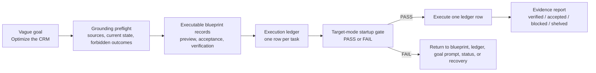

# Blueprint-Driven Project Runner for Codex

[](https://github.com/huo-huohuo/blueprint-driven-project-runner/stargazers)
[](LICENSE)

Stop AI coding agents from running for days without accepted progress.

Blueprint-Driven Project Runner is a Codex plugin and skill that refuses to start long-running implementation until the work has executable blueprint records, a row-by-row execution ledger, a scoped goal prompt, and evidence-based stop conditions.

It is for the moment when:

- "make this better" becomes a giant diff with no obvious improvement
- "continue optimizing" loops for hours or days
- the agent changes many files but cannot say which accepted requirement moved forward
- the chat thread becomes the only memory and then gets too large to trust

The core rule is simple:

```text
No executable blueprint, no execution ledger, no long-running implementation.
```

## How It Stops Drift



## The Problem

Long AI-assisted projects often fail for a simple reason: the prompt describes desire, but not the judging system.

Typical failure pattern:

| Vague AI run | Blueprint-driven run |
| --- | --- |
| "Optimize the CRM interface." | Define target states, forbidden UI, acceptance checks, and screenshots before coding. |
| "Improve the backend." | Write business scenarios, data contracts, idempotency rules, failure behavior, and tests. |
| "Keep going until it is mature." | Execute ledger rows one at a time, with evidence and stop conditions. |
| Progress is measured by activity. | Progress is measured by accepted blueprint records. |
| The thread becomes the memory. | Project files become the memory. |

## A Failure This Prevents

A CRM improvement run can sound clear at the prompt level:

```text
Keep optimizing the CRM interface until it is complete.
```

But after two days, the agent may still be changing code because "complete" was never converted into a judging system. This plugin forces the run to answer first:

- Which blueprint record IDs are being completed?
- Which ledger row is active now?
- What files are allowed and forbidden?
- What evidence proves this row is accepted?
- When should the run stop instead of continuing?

If those answers do not exist, the target-mode startup gate fails and implementation does not begin.

## What This Gives You

- Executable blueprint records with source evidence, target behavior, forbidden results, preview, acceptance, and verification.
- A grounding preflight that blocks polished-but-vague blueprints before implementation starts.
- Execution ledgers that turn broad work into row-level goals, paths, acceptance standards, verification methods, status, blockers, and resume conditions.
- A target-mode startup gate that fails closed when ready blueprints, work slices, ledger rows, scoped goal prompts, or execution contracts are missing.
- Goal prompts that bind Codex to specific blueprint record IDs and ledger row IDs.
- Linting and artifact scoring for generated blueprints, goal prompts, and execution contracts.
- Handoff packages so a fresh Codex thread can continue without inheriting a giant chat history.
- A project governance installer that adds `docs/ai-control` and `tools/ai-control` to any target repository.

## When To Use It

Use this when:

- A Codex task may run for hours or across multiple threads.
- The request contains words like "optimize", "complete", "professional", "mature", "robust", or "comprehensive".
- Frontend work needs target states, previews, and screenshots before broad editing.
- Backend work needs data contracts, idempotency, failure behavior, and evidence.
- You need a fresh thread to continue safely without copying months of chat history.
- Previous AI runs changed many files but did not produce visible, accepted progress.

Do not use it for tiny one-file fixes, quick explanations, or one-off experiments where a normal prompt is enough.

## Install Options

This repository now supports two distribution shapes:

- **Codex plugin**: recommended for public sharing and future Codex distribution.
- **Direct skill install**: simple local install for people who only want the skill folder.

## Install As A Codex Plugin

Use this repository as a plugin root in Codex builds that support plugin installation from a local or GitHub source.

The plugin manifest is:

```text
.codex-plugin/plugin.json
```

The plugin skill payload is:

```text
skills/blueprint-driven-project-runner/
```

The root `SKILL.md` is kept for direct skill installs. When maintaining the repository, sync the plugin payload after changing the root skill:

```bash
python scripts/sync_plugin_skill.py
```

Then validate:

```bash
python ~/.codex/skills/.system/plugin-creator/scripts/validate_plugin.py .
```

## Install As A Direct Codex Skill

Install as a Codex skill:

```bash
git clone https://github.com/huo-huohuo/blueprint-driven-project-runner.git ~/.codex/skills/blueprint-driven-project-runner
```

Windows PowerShell:

```powershell
git clone https://github.com/huo-huohuo/blueprint-driven-project-runner.git "$env:USERPROFILE\.codex\skills\blueprint-driven-project-runner"
```

Restart Codex or reload skills if needed.

Then ask Codex:

```text
Use $blueprint-driven-project-runner.
Create an executable blueprint before implementation.
Do not start coding until the blueprint has source evidence, forbidden results, preview, acceptance, verification, and execution ledger rows.
```

## Relationship To Nearby Skills

This plugin is the control layer for large or risky AI-assisted projects. It should not absorb every planning task.

| Need | Best fit |
| --- | --- |
| Large project planning, recovery, execution ledgers, handoff, drift control | `blueprint-driven-project-runner` |
| Small measurable objective before a short task | `define-goal` |
| Ambiguous user request that needs clarification before any plan exists | `understand-user-intent` |
| Lightweight repo guardrails only, without full blueprint/ledger flow | `codex-project-governance-kit` |
| Code review or regression risk review | `review` |
| Red-green-refactor implementation | `tdd` |

Rule of thumb: when the project might run across hours, threads, modules, or broad file scopes, use this plugin as the project control system.

## Add Governance Files To A Project

After installing the skill, install the project-level control system:

```bash
python ~/.codex/skills/blueprint-driven-project-runner/scripts/install_governance_system.py --project /path/to/project --module "Your Module"
```

Windows PowerShell:

```powershell
python "$env:USERPROFILE\.codex\skills\blueprint-driven-project-runner\scripts\install_governance_system.py" --project "C:\path\to\project" --module "Your Module"
```

This creates:

```text
docs/ai-control/
tools/ai-control/
```

Those files become the durable project control surface. Do not rely on chat history as the project constitution.

## Try The Example

This repository includes a minimal inventory example and a before/after packaging example:

- `examples/minimal-inventory/`
- `examples/vague-goal-to-executable-blueprint.md`

Run the example checks:

```bash
python scripts/lint_blueprints.py --path examples/minimal-inventory/docs/ai-control/inventory/engineering-blueprint.md
python scripts/score_blueprint_artifact.py --path examples/vague-goal-to-executable-blueprint.md --mode blueprint
```

Generate a bounded goal prompt from the sample blueprint:

```bash
python scripts/generate_goal_prompt.py --project examples/minimal-inventory --module "Inventory" --record INVENTORY-IMPORT-IDEMPOTENCY-001 --work-slice WS-IMPORT-001 --ledger-row LEDGER-INVENTORY-001
```

## The Core Loop

```text
intent
-> grounding preflight
-> discovery brief
-> executable blueprint records
-> preview checklist
-> work slices
-> execution ledger
-> goal prompt
-> execution contract
-> implementation
-> evidence
-> accepted ledger rows
```

No executable blueprint, no execution ledger, no long-running implementation.

Target-mode runs must pass the startup gate before implementation:

```text
ready blueprint records
-> bounded work slice
-> execution ledger rows
-> scoped goal prompt
-> execution contract
-> one ledger row at a time
```

If any part is missing, return to blueprint, ledger, goal-prompt, status, or recovery mode instead of coding.

## Minimal Workflow

1. Install the governance system into your project.
2. Compile executable blueprint records with source, current evidence, target behavior, forbidden result, preview, acceptance, and verification.
3. Run `lint_blueprints.py`.
4. Decompose ready records into `docs/ai-control/91-execution-ledger.md`.
5. Generate a bounded goal prompt for selected ledger rows.
6. Run `lint_goal_prompt.py`.
7. Execute one ledger row at a time.
8. Mark rows `accepted`, `blocked`, `shelved`, or `skipped` with evidence and resume conditions.
9. Use `generate_handoff_package.py` when moving work to a fresh thread.

## Common Commands

Lint blueprint records:

```bash
python tools/ai-control/lint_blueprints.py --project .
```

Generate a goal prompt:

```bash
python tools/ai-control/generate_goal_prompt.py --project . --module "Inventory" --record INVENTORY-IMPORT-IDEMPOTENCY-001 --work-slice WS-IMPORT-001 --ledger-row LEDGER-INVENTORY-001
```

Lint generated goal prompts:

```bash
python tools/ai-control/lint_goal_prompt.py --project .
```

Score a generated blueprint, goal prompt, or execution contract:

```bash
python tools/ai-control/score_blueprint_artifact.py --path docs/ai-control/example-artifact.md
```

Show project status:

```bash
python tools/ai-control/status.py --project .
```

Generate a fresh-thread handoff package:

```bash
python tools/ai-control/generate_handoff_package.py --project . --module "Inventory" --record INVENTORY-IMPORT-IDEMPOTENCY-001 --work-slice WS-IMPORT-001
```

## Repository Layout

```text
.
|-- SKILL.md
|-- agents/
|   `-- openai.yaml
|-- references/
|   |-- blueprint-examples.md
|   |-- evaluation-cases.md
|   |-- goal-prompt-protocol.md
|   |-- project-operating-standard.md
|   |-- quality-bars.md
|   |-- technical-blueprint-questionnaire.md
|   `-- templates.md
|-- scripts/
|   |-- generate_goal_prompt.py
|   |-- generate_handoff_package.py
|   |-- install_governance_system.py
|   |-- lint_blueprints.py
|   |-- lint_goal_prompt.py
|   |-- scaffold_control_pack.py
|   |-- score_blueprint_artifact.py
|   `-- status.py
`-- examples/
```

## Validation

Validate the skill folder:

```bash
python ~/.codex/skills/.system/skill-creator/scripts/quick_validate.py ~/.codex/skills/blueprint-driven-project-runner
```

Compile bundled scripts:

```bash
python -m compileall -q scripts
```

For SkillOpt-style iteration, use `references/evaluation-cases.md` as the failure-case suite and accept only revisions that preserve or improve those cases.

Validate the plugin wrapper:

```bash
python ~/.codex/skills/.system/plugin-creator/scripts/validate_plugin.py .
```

## Shareable One-Liner

Blueprint-Driven Project Runner is a Codex skill that stops long-running AI coding agents from drifting by forcing executable blueprints, execution ledgers, bounded goal prompts, and evidence gates before broad implementation.

## Share The Project

Use [`docs/share-kit.md`](docs/share-kit.md) for ready-to-post descriptions, suggested GitHub topics, and audience notes.

## Design Principle

Complete the referenced executable blueprint records and execution ledger rows exactly, with evidence, without expanding scope.

The skill is intentionally narrow. It does not replace product thinking, design judgment, engineering review, or user approval. It gives AI-assisted projects a stable control surface so large work can be planned, executed, reviewed, and resumed with less drift.

## License

MIT
